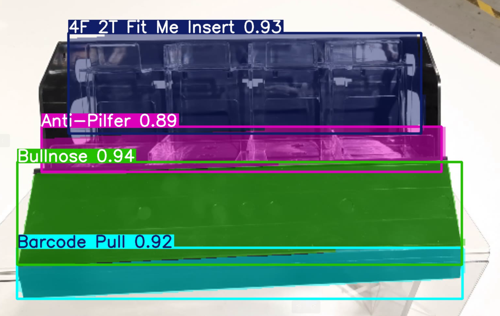

# <div align='center'>Component Identification</div>

This project focuses on leveraging computer vision and deep learning techniques to identify components of a device and detect missing parts. By using advanced object detection and image processing algorithms, the system ensures accurate identification and quality assurance in manufacturing and maintenance workflows. The project is designed to streamline operations, reduce human error, and improve efficiency in device assembly and inspection. 

## Example



## Dataset

Here, I have used different images of the device.


## <div style="padding-top: 20px"> Steps to run </div>

<div style="padding-bottom:10px"><b>STEP 00 :</b> Clone the repository</div>

```bash
git clone https://github.com/utpalpaul108/Component-Identification
```
<div style="padding-top:10px"><b>STEP 01 :</b> Create a virtual environment after opening the repository and then activate the environment</div><br>

Using Anaconda Virtual Environments

```bash
cd Component-Identification
conda create -n venv python=3.10 -y
conda activate venv
```
Or for Linux operating system

```bash
cd Component-Identification
python3.10 -m venv venv
source venv/bin/activate
```
Or for Windows operating system (Using Command Prompt)

```bash
cd Component-Identification
python -m venv venv
venv\Scripts\activate
```

<div style="padding-top:10px; padding-bottom:10px"><b>STEP 02 :</b> Install the requirements</div>

```bash
pip install -r requirements.txt
```

Finally, run the following command to start your application (For Default Camera)
```bash
python app.py 
```
If it's don't work, try with different camera id.
```bash
python app.py --camera-id 1  # [0, 1, 2, 3,...]
```

<div style="padding-top:10px"><b>STEP 03 :</b> Stop the application</div>

press `q` to stop the application.

<div style="padding-top:10px"><b>STEP 04 :</b> Your application is now successfully set up. The next time you want to run the application, activate the virtual environment and execute the program.</div><br>

For Windows operating system (Using Command Prompt)
```bash
cd Component-Identification
venv\Scripts\activate
```
```bash
python app.py
```


