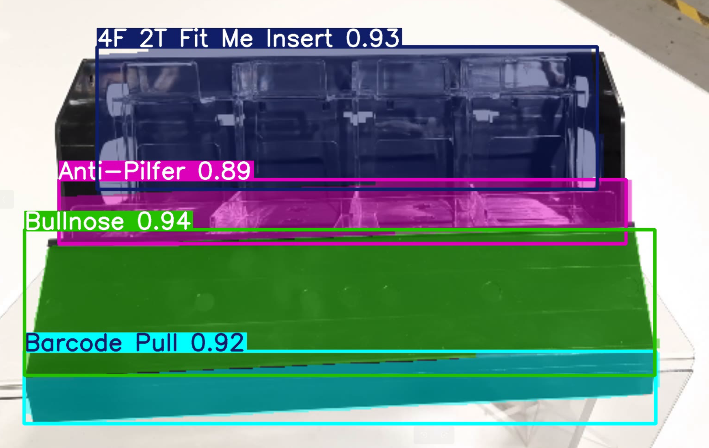

# <div align='center'>Component Identification</div>

This project focuses on leveraging computer vision and deep learning techniques to identify components of a device and detect missing parts. By using advanced object detection and image processing algorithms, the system ensures accurate identification and quality assurance in manufacturing and maintenance workflows. The project is designed to streamline operations, reduce human error, and improve efficiency in device assembly and inspection. 

## Example



## Dataset

Here, I have used different images of the device.


## <div style="padding-top: 20px"> Steps to run on Raspberry Pi</div>

<div style="padding-bottom:10px"><b>STEP 00 :</b> Clone the repository</div>

```bash
git clone https://github.com/utpalpaul108/Component-Identification
```
Create a project directory and place the code files of the following path within it. 
```bash
https://github.com/utpalpaul108/Component-Identification/RaspberryPi
```
<div style="padding-top:10px"><b>STEP 01 :</b> Navigate to the project directory, create a virtual environment, and activate it. 
</div><br>

```bash
cd Component-Identification
python3.10 -m venv venv # replace with your python version
source venv/bin/activate
```

<div style="padding-top:10px; padding-bottom:10px"><b>STEP 02 :</b> Install the requirements</div>


```bash
sudo apt update
sudo apt install python3-pip -y
pip install -U pip
```
```bash
pip install -r requirements.txt
```
```bash
pip install ultralytics[export]
```

Finally, run the following command to start your application (For Default Camera)
```bash
python app.py 
```
If it's don't work, try with different camera id.
```bash
python app.py --camera_id 1  # [0, 1, 2, 3,...]
```

<div style="padding-top:10px"><b>STEP 03 :</b> Stop the application</div>

press `q` to stop the application.

<div style="padding-top:10px"><b>STEP 04 :</b> Rerun the application</div>
<p>Your application is now successfully set up. The next time you want to run the application, activate the virtual environment and execute the program.</p>


```bash
cd Component-Identification
source venv/bin/activate 
```
```bash
python app.py
```


